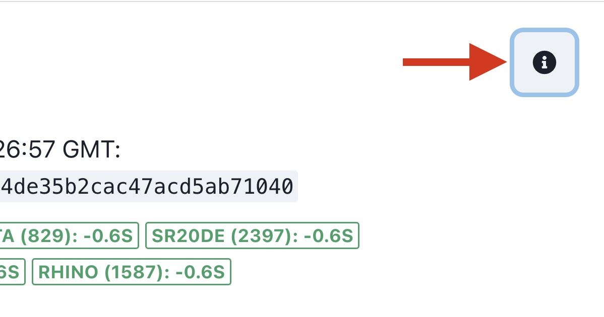

## Drand Bots

### Introduction

Bots bring randomness from drand to the Nois blockchain. That's the only thing the bot does. Once that randomness is on chain, it will be offered to Dapps across the Cosmos.

> **ℹ️ Drand-bots do not and cannot generate randomness. The simply relay it from drand to nois chains.**

> **ℹ️ Drand-bots are never slashed and do not need to put any collateral simply because they cannot cheat.**

> **⚠️ Although drand-bots cannot impact the outcome of the randomness, they can impact the availability of the randomness by stopping to work or by failing to submit to the nois chain.
> This is why they are incentivised and constitute a critical piece of Nois.**

### Running a Drand Bot

There are two available tools available

#### drand-bot-1

##### Running using a Docker image.

The Docker image is probably the most convenient way to run the bot.
Install Docker as explained [here](https://docs.docker.com/engine/install/ubuntu/).
Download the latest version of the bot image:

```shell
docker pull noislabs/nois-bot:latest
```

Run the bot as follows:

```shell
# Make sure you have tokens in your wallet
export MNEMONIC='<YOUR_MNEMONICS_HERE>'


#check Networks -> contract in these docs for NOIS_DRAND_CONTRACT_ADDR
export NOIS_CONTRACT=<NOIS_DRAND_CONTRAC_ADDR>
#example export NOIS_CONTRACT=nois16peq3sftghumkja7nu32ztjy0ew4vsnshxfhcv6sxq573ta08gwsgldepm
export ENDPOINT=https://nois.rpc.bccnodes.com:443
export MONIKER=your-beautiful-name
#Many RPCs are available. For more info check discord #validator channel
#https://nois.rpc.bccnodes.com/

#edit above values before running the docker
docker run \
       -e MONIKER=$MONIKER \
       -e "MNEMONIC=$MNEMONIC" \
       -e PREFIX=nois \
       -e DENOM=unois \
       -e NOIS_CONTRACT=$NOIS_CONTRACT \
       -e ENDPOINT=$ENDPOINT \
       -e GAS_PRICE=0.05unois \
       noislabs/nois-bot:latest
```

##### Upgrading Docker image

Run

```
docker pull noislabs/nois-bot:latest
```

and re-start the bot as shown above.

##### Using a plain Node.js script

The bot can also be run without containerization. This requires some Node.js knowledge and is more manual work. But it gives operators more control and is especially useful for debugging. Instructions are maintained [here](https://github.com/noislabs/nois-bot/blob/main/RUN_ON_SERVER.md).

#### drand-bot-2

[TODO]

### Performance factors of drand-bots

the main criteria in running a fast drand-bot is being able to broadcast your tx as fast as possible in order to reach the proposer's node asap before the other drand-bots.
this will allow your submission tx to be placed among the first 6 bots in the mempool of the proposer's node.
Obviously you need a good cpu and a fast connection that is very close to an rpc node.
Your rpc node needs to be fast in the network and eventually needs to have fast direct peers so it can reach the proposer before the competitor drand-bot operators.
Choosing an rpc node that is heavily used or that many other bot operators are using would not be optimal. Using an rpc that has big voting power can slightly increase your chances because that node gets chosen to propose blocks a bit more often than other validator nodes so sometimes you get that small advantage when your RPC is the block proposer. But this is a very small difference and often validator nodes do not offer an rpc endpoint.
In general if you get like +3 second delay it is not because your bot submitted the tx 3 seconds later than the other drand-bots but because they were few ms before you so the proposer did not choose to select you in the proposed block because there is a consensus blockspace that only allows 4-5 submissions. so your submission becomes leftover for the next block (in 3 seconds) and if you also miss the second block because there are more than 10 operators faster than your drand-bot. then your submission only gets included in the block afterwards so +6seconds.

### Check Submissions

In order to check the submissions you can visit this Nois randomness [dashboard](https://randomness.nois.network/)

This tools shows randomness that was verified on the Nois blockchain. The source of randomness is drand, a decentralized random number generator which produces a so called "random beacon" every 3 seconds. Beacons are submitted as transaction to Nois by off-chain bots. Since beacons are cryptographically signed by drand, bots cannot influence the randomness. A strong and diverse set of bot operator makes the submission of beacons fast and relyable. Bots are incentivised for submissions. They receive a rewards if they are registered and allow-listed.

| Badge Color | Description                                    |
| ----------- | ---------------------------------------------- |
| Green       | Bot received a reward                          |
| Red         | Bot is registered but did not receive a reward |
| Gray        | Bot is not eligible for a reward               |

##### Check if your bot is allowlisted

- Navigate to the randomness [dashboard](https://randomness.nois.network/)
- On the top right of the page click on info
  
- Scroll down and check the allowlisted addresses

### Incentive System

[TODO]
